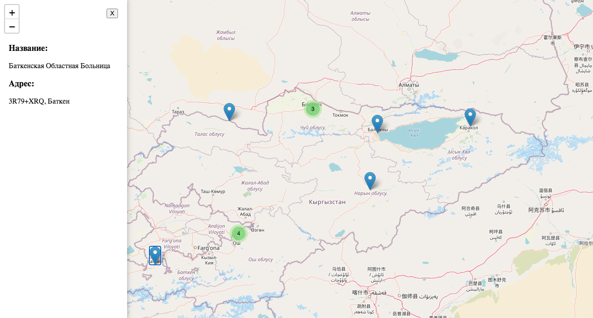

# Hospital map

Интерактивная карта, где можно будет добавить рассположение больниц или других мест, через админку

## Установка и запуск

1. Убедитесь, что у вас установлен Python версии 3.11. и Django
2. 
   Клонируйте репозиторий с проектом:

       https://github.com/hereyourname-hub/map-leaflet.git

3. Перейдите в директорию проекта:

      cd map_project

   3.1Создайте виртуальное окружение и активируйте его:

На Windows:

      python -m venv myenv

      myenv\Scripts\activate
      
На macOS и Linux:

      python3 -m venv myenv

      source myenv/bin/activate

4. Запустите миграции базы данных:

    python3 manage.py migrate

5. Запустите сервер разработки:

    python3 manage.py runserver
